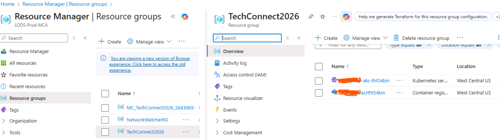

# Exercise 2: Verify Azure Resources Setup

In this exercise, you will use GitHub Copilot to help you connect to the pre-provisioned Azure resources including the resource group and AKS cluster.

## Verify Azure Resources

1. Login to the [Azure Portal](https://portal.azure.com) from browser using the credentials available in the **Resources** tab.
   - **Username**: `<from resources tab>`
   - **Password**: `<from resources tab>`

2. Once logged in, you will see the Resource group named **"TechConnect2026"** containing your pre-provisioned AKS cluster.

   

3. Note the **AKS cluster name** from the Azure Portal - you will need it in the next step.

<details>
<summary><b>Step 1: Get AKS Credentials using GitHub Copilot</b></summary>

1. Ask GitHub Copilot:

```
@terminal How do I get kubectl credentials for my AKS cluster in resource group 'TechConnect2026'?
```

2. Copilot should suggest:

```bash
az aks get-credentials --resource-group TechConnect2026 --name <your-aks-cluster-name>
```

3. Replace `<your-aks-cluster-name>` with the AKS cluster name you noted from the Azure Portal, then execute the command to configure kubectl to use your AKS cluster.

4. Verify connectivity:

```bash
kubectl get nodes
```

You should see nodes in "Ready" state.

</details>


### Summary
✅ kubectl is configured to access the pre-provisioned AKS cluster  
---