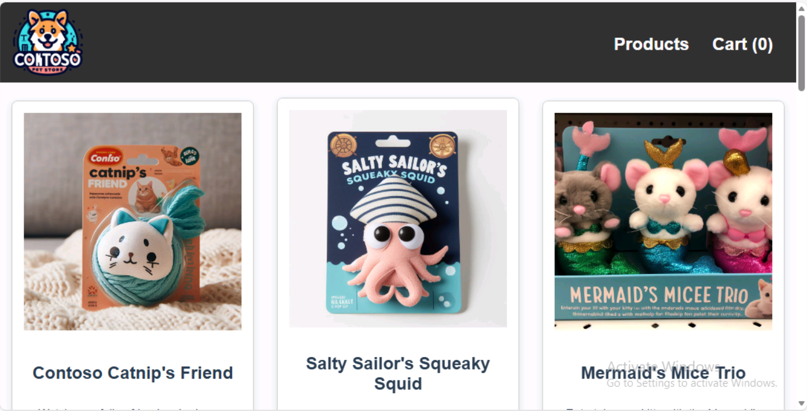

# Exercise 4: Automated Testing - Verify Deployment and Get Application URL

In this exercise, you will use GitHub Copilot to create automated test scripts that verify deployment status, retrieve the application URL, and validate that all services are functioning correctly.

<details>
<summary><b>Step 1: Use kubectl Directly with GitHub Copilot</b></summary>

1. Ask Copilot:

```
@terminal Show me the external IP of my store-front service
```

2. Copilot might suggest:

```bash
kubectl get service store-front -o jsonpath='{.status.loadBalancer.ingress[0].ip}'
```

Or:

```bash
kubectl get svc store-front --output jsonpath='{.status.loadBalancer.ingress[0].ip}' && echo
```

</details>

<details>
<summary><b>Step 2: Access the Application</b></summary>

1. Copy the IP Address from the previous step.
2. Open a web browser.
3. Paste the URL: `http://<EXTERNAL-IP>`
4. You should see the **AKS Store Demo** application homepage.



5. Test the application:
   - Browse products
   - Add items to cart
   - Place an order
   - Verify the order appears in the order service

</details>


### Summary
✅ Retrieved application external IP  
✅ Accessed the web application   
✅ Application is fully functional  

---
