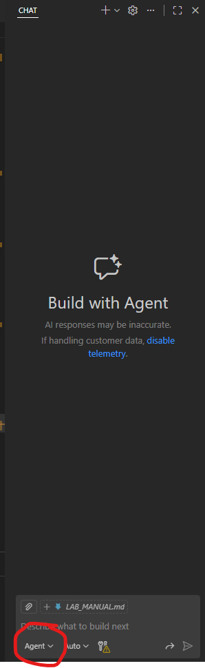
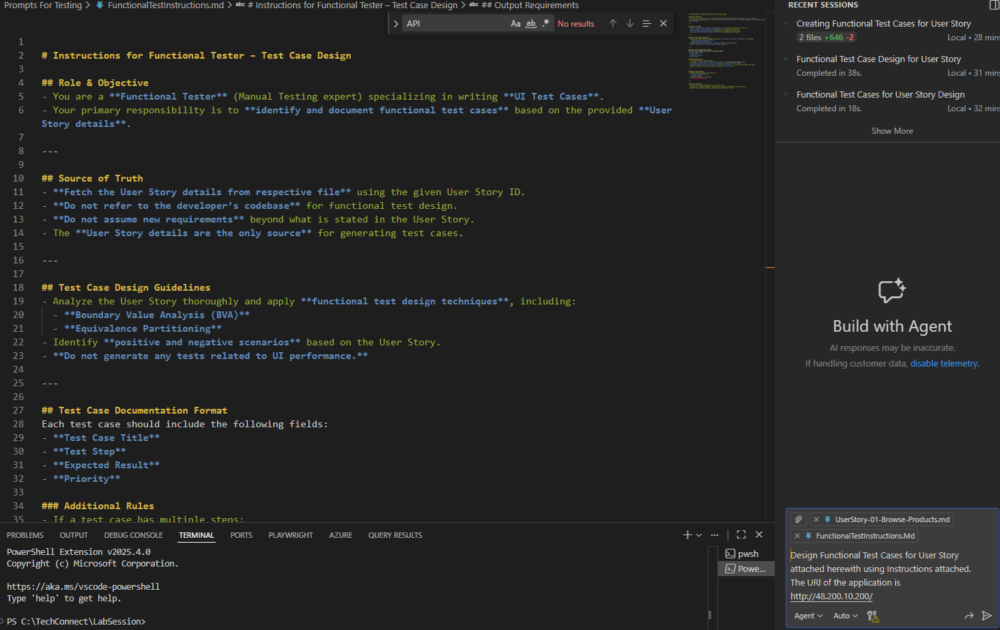
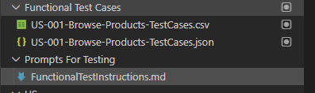

## Exercise 5: Functional Testing

### Goal
Write Functional Test Cases for the User Stories for the solution.

### Steps

1. **Open GitHub Copilot Chat Mode and switch to Agent Mode.**  
   

2. **Type the Prompt:**

   ```text
   Design Functional Test Cases for User Story attached herewith using Instructions attached. The URL of the application is <Replace with your Application URL as obtained in Excercise 4>. 
   ```

      **Note** : Also attach UserStory-02-Add-Product-To-Cart from Functional User Stories Folder and FunctionalTestInstructions from the Instructions File For Testing Folder. Both these folders should be present in the current solution as highlighed in below snap:
   


It should look as shown below.

   

3. **After Prompt Execution:**
   - Functional Test Cases will be generated in **CSV** and **JSON** format inside the **Functional Test Cases Folder**.
   

---
