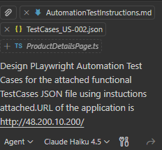

## Exercise 6: Test Automation Using Playwright MCP Server

### Goal
Write Automation Test Scripts for the User Stories for the solution.

### Steps

1. **Check if Playwright MCP Server is added:**
   - Click on **Tools** in Chat Window.  
     
   - In the dropdown that opens, ensure **Playwright MCP Server** is available and selected.  
     

2. a. **If Playwright MCP Server is not added:**
   - Press `Ctrl+Shift+P` and type:
     ```
     MCP: open User Configuration
     ```
     
   - Add the following configuration:

     ```json
     "playwright": {
       "command": "npx",
       "args": [
         "@playwright/mcp@latest"
       ],
       "type": "stdio"
     }
     ```

   - Click **Run**. The configuration should now appear in Tools.  
     

     b. If Chrome is not present in the system,
         You can install the same from the Internet.
          

3. **Create Automation Script from Scratch:**
   - Type the prompt:

     ```text
     Design Playwright Automation Test Cases for the attached functional TestCases JSON file using instructions attached. URL of the application is <<Your Application URL>>.
     ```

   - Also attach the following to the prompt:
     - `AutomationScriptCreationInstructions` from the **Instructions File** in the Testing folder of the repository as shown below:
         

     - The relevant Test Case.JSON file as generated in Excercise 5.
       

   - This will create all necessary Playwright UI Automation Test Cases.  
     

4. **Permissions:**
   - Ensure you select **Allow All** for all requests from the Agent.
