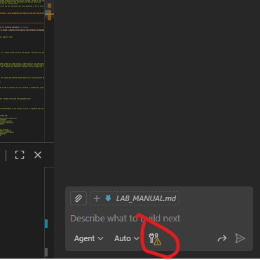
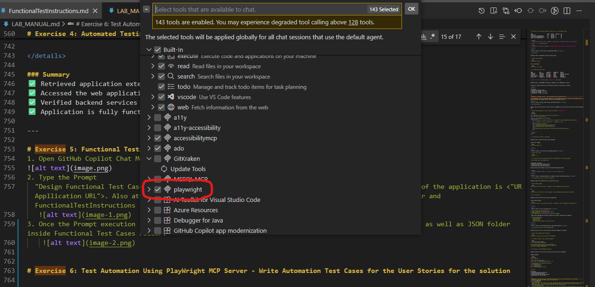
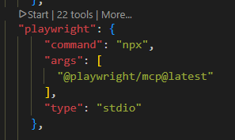
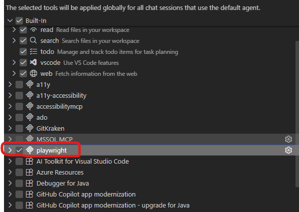
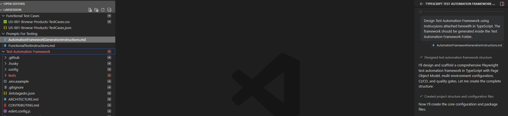

# Learn Test Automation Strategies in GHCP
## Leveraging GitHub Copilot Agent Mode for Kubernetes Deployment and Testing

---

## Abstract

Welcome to the GitHub Copilot Test Automation Lab! In this hands-on lab, you will learn how to leverage **GitHub Copilot Agent Mode** to deploy and test a microservices-based e-commerce application on Azure Kubernetes Service (AKS). 

This lab demonstrates how GitHub Copilot can assist with:
- Automated infrastructure setup and deployment
- Writing test scripts and validation commands
- Automated health checks and monitoring
- Troubleshooting and debugging strategies
- Creating reusable automation scripts

The application consists of 4 microservices:
- **Store-Front**: Vue.js web interface for customers
- **Order-Service**: Node.js/Fastify API for order management
- **Product-Service**: Rust/Actix API for product catalog  
- **RabbitMQ**: Message queue for async order processing

By the end of this lab, you will understand how to use GitHub Copilot to automate testing workflows and operational tasks for Kubernetes applications.

---

## Lab Duration
**Estimated Time**: 60-90 minutes

## Lab Structure
1. **Exercise 1**: VM Setup and Prerequisites Installation
2. **Exercise 2**: Azure Resources Setup using GitHub Copilot
3. **Exercise 3**: Deploy Application to AKS using GitHub Copilot
4. **Exercise 4**: Automated Testing - Verify Deployment and Get Application URL
5. **Exercise 5**: Test Automation Strategies with GitHub Copilot

---

# Exercise 1: VM Setup and Prerequisites Installation

In this exercise, you will set up your development VM with all necessary tools and authenticate to Azure. You'll use GitHub Copilot to help install and configure these tools.

> [!IMPORTANT]
> Make sure you have access to GitHub Copilot in your VS Code environment before starting this lab.

<details>
<summary><b>Step 1: Launch and Login to Lab VM</b></summary>

1. Open the **Resources** tab next to the instructions to get your VM credentials.
2. Connect to the VM using RDP (Windows) or SSH (Linux).
3. Login with the provided credentials:
   - **Username**: `labuser`
   - **Password**: `<from resources tab>`
4. Once logged in, open **Visual Studio Code** from the desktop or start menu.

</details>

<details>
<summary><b>Step 2: Verify GitHub Copilot is Available</b></summary>

1. In VS Code, press `Ctrl+Shift+P` (or `Cmd+Shift+P` on Mac) to open the command palette.
2. Type **"GitHub Copilot: Sign In"** and press Enter.
3. Follow the authentication flow if not already signed in.
4. Verify GitHub Copilot is active by looking for the Copilot icon in the bottom right status bar.
5. Open GitHub Copilot Chat by pressing `Ctrl+Alt+I` or clicking the chat icon in the sidebar.

> [!NOTE]
> If GitHub Copilot is not installed, use the Extensions marketplace to install "GitHub Copilot" and "GitHub Copilot Chat" extensions.

</details>

<details>
<summary><b>Step 3: Use GitHub Copilot to Install Azure CLI</b></summary>

1. Open GitHub Copilot Chat in VS Code (`Ctrl+Alt+I`).
2. Ask Copilot:

```
@terminal I need to install Azure CLI on my Windows VM. Please provide the installation commands.
```

3. Review Copilot's suggestions and follow the installation steps.
4. Expected commands (Copilot should suggest similar):

```powershell
# Install Azure CLI using winget
winget install -e --id Microsoft.AzureCLI

# Or using PowerShell
$ProgressPreference = 'SilentlyContinue'
Invoke-WebRequest -Uri https://aka.ms/installazurecliwindows -OutFile .\AzureCLI.msi
Start-Process msiexec.exe -Wait -ArgumentList '/I AzureCLI.msi /quiet'
Remove-Item .\AzureCLI.msi
```

5. After installation, verify by running:

```powershell
az --version
```

</details>

<details>
<summary><b>Step 4: Use GitHub Copilot to Install kubectl</b></summary>

1. In GitHub Copilot Chat, ask:

```
@terminal How do I install kubectl on Windows to manage Kubernetes clusters?
```

2. Follow Copilot's instructions. Expected commands:

**Method 1: Using Azure CLI (Recommended)**
```powershell
# Install kubectl using Azure CLI
az aks install-cli
```

**Method 2: Direct Download**
```powershell
# Download the latest kubectl release
curl.exe -LO "https://dl.k8s.io/release/v1.29.0/bin/windows/amd64/kubectl.exe"

# Create a directory for kubectl
New-Item -ItemType Directory -Force -Path C:\kubectl

# Move kubectl to the directory
Move-Item -Path kubectl.exe -Destination C:\kubectl\kubectl.exe

# Add to PATH (for current session)
$env:Path += ";C:\kubectl"

# Add to PATH permanently (requires admin)
[Environment]::SetEnvironmentVariable("Path", $env:Path + ";C:\kubectl", [EnvironmentVariableTarget]::Machine)
```

**Method 3: Using Chocolatey**
```powershell
# If you have Chocolatey installed
choco install kubernetes-cli
```

**Method 4: Using winget**
```powershell
# Using Windows Package Manager
winget install -e --id Kubernetes.kubectl
```

3. Verify installation:

```powershell
kubectl version --client
```

Expected output:
```
Client Version: v1.29.0
Kustomize Version: v5.0.4-0.20230601165947-6ce0bf390ce3
```

4. Test kubectl is working:

```powershell
kubectl cluster-info
```

> [!NOTE]
> If kubectl command is not recognized, close and reopen your terminal to refresh the PATH environment variable.

</details>

<details>
<summary><b>Step 5: Use GitHub Copilot to Install Git</b></summary>

1. Ask GitHub Copilot:

```
@terminal Install Git on my Windows machine
```

2. Follow the suggested commands:

```powershell
# Install Git using winget
winget install --id Git.Git -e --source winget
```

3. Verify installation:

```powershell
git --version
```

</details>

<details>
<summary><b>Step 6: Clone the Lab Repository using GitHub Copilot</b></summary>

1. In Copilot Chat, ask:

```
@terminal Clone the repository https://github.com/Azure-Samples/aks-store-demo to my current directory
```

2. Copilot should suggest:

```bash
git clone https://github.com/Azure-Samples/aks-store-demo.git
cd aks-store-demo
```

3. Alternatively, if you have the local files, ask Copilot:

```
@workspace Open the folder containing the aks-store-quickstart.yaml file
```

</details>

<details>
<summary><b>Step 7: Authenticate to Azure using GitHub Copilot</b></summary>

1. Ask GitHub Copilot:

```
@terminal How do I login to Azure using Azure CLI?
```

2. Follow the suggested command:

```bash
az login
```

3. A browser window will open. Sign in with your Azure credentials provided in the lab:
   - **Username**: `<from resources tab>`
   - **Password**: `<from resources tab>`

4. After successful login, verify your subscription:

```bash
az account show
```

5. If you have multiple subscriptions, set the correct one:

```bash
az account set --subscription "<subscription-id>"
```

</details>

### Summary
✅ You have successfully set up your VM with all required tools  
✅ Azure CLI, kubectl, and Git are installed  
✅ You are authenticated to Azure  
✅ GitHub Copilot is ready to assist you  

---

# Exercise 2: Azure Resources Setup using GitHub Copilot

In this exercise, you will use GitHub Copilot to help you create the necessary Azure resources including a resource group and an AKS cluster.

<details>
<summary><b>Step 1: Ask GitHub Copilot for Resource Group Creation</b></summary>

1. Open GitHub Copilot Chat and ask:

```
@terminal Create an Azure resource group named 'aks-store-rg' in the eastus region
```

2. Copilot should suggest a command similar to:

```bash
az group create --name aks-store-rg --location eastus
```

3. Execute the command in the terminal.
4. Verify the resource group was created:

```bash
az group show --name aks-store-rg
```

</details>

<details>
<summary><b>Step 2: Use GitHub Copilot to Create AKS Cluster</b></summary>

1. In Copilot Chat, provide a detailed request:

```
@terminal Create an AKS cluster named 'aks-store-cluster' in resource group 'aks-store-rg' with the following specifications:
- Node count: 3
- Node VM size: Standard_DS2_v2  
- Enable managed identity
- Enable monitoring
- Kubernetes version: 1.28 or latest
```

2. GitHub Copilot should suggest something like:

```bash
az aks create \
  --resource-group aks-store-rg \
  --name aks-store-cluster \
  --node-count 3 \
  --node-vm-size Standard_DS2_v2 \
  --enable-managed-identity \
  --enable-addons monitoring \
  --generate-ssh-keys \
  --location eastus
```

3. Execute the command. **This will take approximately 5-10 minutes to complete.**

> [!NOTE]
> While the AKS cluster is being created, you can read through the next steps to understand what we'll be deploying.

4. Once complete, verify the cluster:

```bash
az aks show --resource-group aks-store-rg --name aks-store-cluster --output table
```

</details>

<details>
<summary><b>Step 3: Get AKS Credentials using GitHub Copilot</b></summary>

1. Ask GitHub Copilot:

```
@terminal How do I get kubectl credentials for my AKS cluster named 'aks-store-cluster' in resource group 'aks-store-rg'?
```

2. Copilot should suggest:

```bash
az aks get-credentials --resource-group aks-store-rg --name aks-store-cluster
```

3. Execute the command to configure kubectl to use your AKS cluster.

4. Verify connectivity:

```bash
kubectl get nodes
```

You should see 3 nodes in "Ready" state.

</details>

<details>
<summary><b>Step 4: Inspect the Application Manifest using GitHub Copilot</b></summary>

1. Open the file `aks-store-quickstart.yaml` in VS Code.

2. Select some portion of the YAML and ask Copilot:

```
@workspace Explain what this Kubernetes manifest deploys
```

3. Copilot will explain that this manifest deploys:
   - **RabbitMQ StatefulSet**: Message broker for async order processing (with management console on port 15672)
   - **Order-Service Deployment**: Node.js API for handling customer orders (port 3000)
   - **Product-Service Deployment**: Rust API for managing product catalog (port 3002)
   - **Store-Front Deployment**: Vue.js customer-facing web application (port 8080)
   - **Services**: 3 ClusterIP services for internal communication and 1 LoadBalancer for external access
   - **ConfigMap**: RabbitMQ plugin configuration
   - **Health Probes**: Startup, readiness, and liveness probes for all services

4. You can ask follow-up questions like:

```
@workspace What environment variables does the order-service need to connect to RabbitMQ?
```

```
@workspace Why is RabbitMQ deployed as a StatefulSet instead of a Deployment?
```

```
@workspace What health check endpoints are configured for these services?
```

</details>

### Summary
✅ Resource group created  
✅ AKS cluster is running with 3 nodes  
✅ kubectl is configured to access the cluster  
✅ You understand the application architecture  

---

# Exercise 3: Deploy Application to AKS using GitHub Copilot

In this exercise, you will deploy the 4-microservice application to your AKS cluster using GitHub Copilot's assistance and learn how to verify the deployment status.

<details>
<summary><b>Step 1: Navigate to the Manifest Directory</b></summary>

1. Ask GitHub Copilot:

```
@terminal Navigate to the directory containing aks-store-quickstart.yaml file
```

2. Copilot might suggest:

```bash
cd aks-store-demo
# or if you're in a different location
cd src
```

3. Verify the file exists:

```bash
ls aks-store-quickstart.yaml
```

</details>

<details>
<summary><b>Step 2: Deploy the Application using GitHub Copilot</b></summary>

1. In Copilot Chat, ask:

```
@terminal Deploy the Kubernetes application using the aks-store-quickstart.yaml manifest file
```

2. GitHub Copilot should suggest:

```bash
kubectl apply -f aks-store-quickstart.yaml
```

3. Execute the command. You should see output similar to:

```
statefulset.apps/rabbitmq created
configmap/rabbitmq-enabled-plugins created
service/rabbitmq created
deployment.apps/order-service created
service/order-service created
deployment.apps/product-service created
service/product-service created
deployment.apps/store-front created
service/store-front created
```

</details>

<details>
<summary><b>Step 3: Monitor Deployment Progress using GitHub Copilot</b></summary>

1. Ask GitHub Copilot:

```
@terminal How do I check if all my Kubernetes pods are running?
```

2. Copilot should suggest:

```bash
kubectl get pods
```

3. You can also ask:

```
@terminal Watch the pods status in real-time
```

Expected response:

```bash
kubectl get pods --watch
```

4. Wait until all 4 pods show "Running" status and "1/1" in the READY column:

```
NAME                               READY   STATUS    RESTARTS   AGE
rabbitmq-0                         1/1     Running   0          2m
order-service-6c8b4d6f9b-xyz       1/1     Running   0          2m
product-service-5d9c7f8d4-abc      1/1     Running   0          2m
store-front-7b8c9d6f5e-def         1/1     Running   0          2m
```

> [!NOTE]
> You should see exactly 4 pods: 1 RabbitMQ, 1 order-service, 1 product-service, and 1 store-front

5. Press `Ctrl+C` to stop watching.

> [!TIP]
> If a pod is not starting, ask Copilot: `@terminal Show me the logs for the pod that's failing`

</details>

<details>
<summary><b>Step 4: Verify Services using GitHub Copilot</b></summary>

1. Ask Copilot:

```
@terminal Show all Kubernetes services and their types
```

2. Copilot should suggest:

```bash
kubectl get services
```

Or for more detail:

```bash
kubectl get svc -o wide
```

3. You should see output like:

```
NAME              TYPE           CLUSTER-IP     EXTERNAL-IP    PORT(S)
kubernetes        ClusterIP      10.0.0.1       <none>         443/TCP
rabbitmq          ClusterIP      10.0.100.1     <none>         5672/TCP,15672/TCP
order-service     ClusterIP      10.0.100.2     <none>         3000/TCP
product-service   ClusterIP      10.0.100.3     <none>         3002/TCP
store-front       LoadBalancer   10.0.100.4     <pending>      80:30080/TCP
```

4. The `store-front` service is type `LoadBalancer`. Ask Copilot:

```
@terminal Why is the EXTERNAL-IP showing as <pending> for my LoadBalancer service?
```

Copilot will explain that Azure is provisioning a public IP, which takes 2-3 minutes.

</details>

### Summary
✅ Application deployed to AKS  
✅ All pods are running successfully  
✅ Services are created  
✅ LoadBalancer is being provisioned  

---

# Exercise 4: Automated Testing - Verify Deployment and Get Application URL

In this exercise, you will use GitHub Copilot to create automated test scripts that verify deployment status, retrieve the application URL, and validate that all services are functioning correctly.

<details>
<summary><b>Step 1: Create a Shell Script using GitHub Copilot</b></summary>

1. Ask GitHub Copilot:

```
Create a bash script that waits for the store-front LoadBalancer service to get an external IP and then displays the application URL
```

2. Copilot should generate a script. Create a file named `get-app-url.sh`:

```bash
#!/bin/bash

echo "Waiting for store-front service to get an external IP..."
echo "This may take 2-3 minutes..."

# Wait for the EXTERNAL-IP to be assigned
while true; do
  EXTERNAL_IP=$(kubectl get service store-front -o jsonpath='{.status.loadBalancer.ingress[0].ip}')
  
  if [ -n "$EXTERNAL_IP" ] && [ "$EXTERNAL_IP" != "<pending>" ]; then
    echo ""
    echo "✅ Deployment successful!"
    echo "=========================================="
    echo "🌐 Application URL: http://$EXTERNAL_IP"
    echo "=========================================="
    echo ""
    echo "Open this URL in your browser to access the AKS Store Demo application."
    break
  fi
  
  echo -n "."
  sleep 5
done
```

3. Ask Copilot how to make it executable:

```
@terminal How do I make this bash script executable?
```

Copilot will suggest:

```bash
chmod +x get-app-url.sh
```

</details>

<details>
<summary><b>Step 2: Run the Script using GitHub Copilot</b></summary>

1. Execute the script:

```bash
./get-app-url.sh
```

2. The script will wait and display dots while the LoadBalancer IP is being assigned.

3. Once ready, you'll see output like:

```
✅ Deployment successful!
==========================================
🌐 Application URL: http://20.12.34.56
==========================================

Open this URL in your browser to access the AKS Store Demo application.
```

> [!NOTE]
> Keep this IP address handy. You'll need it to access the application.

</details>

<details>
<summary><b>Step 3: Alternative Method - Use kubectl Directly with GitHub Copilot</b></summary>

1. If you prefer not to use a script, ask Copilot:

```
@terminal Show me the external IP of my store-front service
```

2. Copilot might suggest:

```bash
kubectl get service store-front -o jsonpath='{.status.loadBalancer.ingress[0].ip}'
```

Or:

```bash
kubectl get svc store-front --output jsonpath='{.status.loadBalancer.ingress[0].ip}' && echo
```

3. You can also ask:

```
@terminal Give me the full URL to access my application
```

Copilot might provide:

```bash
echo "http://$(kubectl get service store-front -o jsonpath='{.status.loadBalancer.ingress[0].ip}')"
```

</details>

<details>
<summary><b>Step 4: Access the Application</b></summary>

1. Copy the URL from the previous step.
2. Open a web browser on your VM or local machine.
3. Paste the URL: `http://<EXTERNAL-IP>`
4. You should see the **AKS Store Demo** application homepage.


5. Test the application:
   - Browse products
   - Add items to cart
   - Place an order
   - Verify the order appears in the order service

</details>

<details>
<summary><b>Step 5: Verify Backend Services using GitHub Copilot</b></summary>

1. Ask Copilot to help you test the backend APIs:

```
@terminal How can I test if my order-service API health endpoint is working?
```

2. Copilot might suggest port-forwarding:

```bash
kubectl port-forward service/order-service 3000:3000
```

3. In another terminal, test the health endpoints:

```bash
# Test order-service health
curl http://localhost:3000/health

# Test product-service health (in a new terminal)
kubectl port-forward service/product-service 3002:3002
curl http://localhost:3002/health
```

4. Ask Copilot to test RabbitMQ connectivity:

```
@terminal Show me how to verify that order-service can connect to RabbitMQ
```

Example commands:

```bash
# List pods
kubectl get pods

# Exec into order-service pod
kubectl exec -it deployment/order-service -- sh

# Inside the pod, test RabbitMQ connectivity
nc -zv rabbitmq 5672
echo "Testing AMQP port"
nc -zv rabbitmq 15672
echo "Testing Management UI port"
```

</details>

### Summary
✅ Retrieved application external IP  
✅ Accessed the web application  
✅ Verified backend services are working  
✅ Application is fully functional  

---

# Exercise 5: Functional Testing - Write Functional Test Cases for the User Stories for the solution
1. Open GitHub Copilot Chat Mode and switch to Agent Mode.

2. Type the Prompt 
  "Design Functional Test Cases for User Story attached herewith using Instructions attached. The URl of the application is <"UR Appllication URL">. Also attach User UserStory-01-Browse-Products from Functional User Stories Folder and FunctionalTestInstructions from the Instructions File For Testing Folder.
   
3. Once the Prompt execution is complete, then you will see the Functional Test Cases generated in CSV as well as JSON folder inside Functional Test Cases Folder.
     


# Exercise 6: Test Automation Using PlayWright MCP Server - Write Automation Test Scripts for the User Stories for the solution

1. Check if Playwright MCP Server is added
   a. Click on Tools in Chat Window
       
   b. In the dropdown for that Opens, make sure the PlayWright MCP server is available and shows as selected.
      
 2. If PlayWright MCP Server is not added
   a. Press Ctrl+Shift+P and then type MCP: open User Configuration     
      
   b.  Add the below configuration
       "playwright": {
			"command": "npx",
			"args": [
				"@playwright/mcp@latest"
			],
			"type": "stdio"
		}
   c. Then click on Run. The same should be clearly seen in tools
          

 3. Create Automation Framework from scratch:
   a.  Type the prompt "Design Test Automation Framework using Instrucyions attached herewith in TypeScript.
        The framework should be generated inside the Test Automation Framework Folder." in the chat window. Also attach the file AutomationFrameworkCreationInstructions present in the Instructions File for Testing folder.It would create all necessary components of the Ui Automation Framework using Playwright.
        

  4. Create Automation Test Scripts for Existing Test Cases created in Excercise 5.
   a.       
    
   

# Bonus Exercise: CI/CD with GitHub Actions

<details>
<summary><b>Bonus: Create a GitHub Actions Workflow for Automated Deployment</b></summary>

In this bonus exercise, you'll use GitHub Copilot to create a complete CI/CD pipeline that automates the deployment of your AKS Store Demo application using GitHub Actions.

### Objective
Create a GitHub Actions workflow that:
- Builds and pushes Docker images to Azure Container Registry (ACR)
- Deploys the updated images to your AKS cluster
- Runs automated health checks after deployment
- Notifies on deployment success or failure

### Instructions

1. **Create the workflow file structure**
   
   Ask GitHub Copilot:
   ```
   Create a .github/workflows directory structure for a GitHub Actions workflow that deploys a microservices application to Azure Kubernetes Service
   ```

2. **Generate the CI/CD workflow**
   
   Ask GitHub Copilot:
   ```
   Create a GitHub Actions workflow that builds Docker images for order-service, product-service, and store-front, pushes them to Azure Container Registry, and deploys to AKS using the aks-store-quickstart.yaml manifest. Include steps for Azure login, ACR authentication, image building with unique tags, updating the Kubernetes manifests with new image tags, and deploying to AKS.
   ```

3. **Add automated testing steps**
   
   Ask GitHub Copilot:
   ```
   Add steps to the workflow that verify all pods are running and perform health checks on all services after deployment
   ```

4. **Configure secrets and environment variables**
   
   Ask GitHub Copilot:
   ```
   What GitHub secrets and environment variables do I need to configure for this workflow to authenticate with Azure and deploy to AKS? List them with descriptions.
   ```

5. **Add deployment notifications**
   
   Ask GitHub Copilot:
   ```
   Add a step to send a Slack notification or create a GitHub issue when the deployment fails
   ```

6. **Implement rollback capability**
   
   Ask GitHub Copilot:
   ```
   Add a manual workflow trigger that can rollback the deployment to the previous version if something goes wrong
   ```

### Challenge Questions

After creating the workflow, ask GitHub Copilot to help you:

- How can I implement a staging environment deployment before production?
- How can I add approval gates for production deployments?
- How can I optimize the Docker build process using layer caching?
- How can I run integration tests between services before deploying?
- How can I implement blue-green or canary deployments?

### Tips for Success

- Use GitHub Copilot Chat to iteratively refine your workflow
- Test each component of the workflow separately before combining
- Use workflow_dispatch trigger for manual testing during development
- Consider security best practices for storing credentials
- Implement proper error handling and cleanup steps

</details>

---

# Lab Completion Checklist

By completing this lab, you have learned to:

- ✅ Set up a development VM with GitHub Copilot assistance
- ✅ Install and configure Azure CLI, kubectl, and Git using AI guidance
- ✅ Create Azure resources (Resource Group, AKS cluster) with Copilot's help
- ✅ Deploy a 4-microservice Kubernetes application using GitHub Copilot
- ✅ Create automated scripts to verify deployment status
- ✅ Build test automation scripts for health checking and monitoring
- ✅ Retrieve application endpoints using automated shell scripts
- ✅ Implement continuous validation strategies with GitHub Copilot
- ✅ Automate troubleshooting workflows using AI-generated scripts
- ✅ Scale, update, and manage Kubernetes resources using Copilot Agent Mode
- ✅ Create reusable test automation templates for Kubernetes applications

## Bonus Achievement (Optional):
- ✅ Design a complete CI/CD pipeline with GitHub Actions using Copilot
- ✅ Implement automated Docker image builds and ACR integration
- ✅ Configure automated deployments to AKS with health validation
- ✅ Set up deployment notifications and rollback capabilities

---

# Key Takeaways

1. **GitHub Copilot Agent Mode** accelerates test automation and deployment validation
2. **AI-assisted script generation** creates comprehensive health checks and monitoring scripts
3. **Automated testing strategies** help ensure deployment reliability and reduce manual effort
4. **Continuous validation** - Copilot helps build reusable test automation frameworks
5. **Learning by doing** - Copilot explains testing strategies while generating executable code
6. **Best practices** - Copilot suggests industry-standard approaches to Kubernetes testing and monitoring

---

# Next Steps

## Continue Your Test Automation Journey:

1. **Advanced Testing**: Create integration tests that validate order flow from store-front → order-service → RabbitMQ
2. **Performance Testing**: Use Copilot to generate load testing scripts with tools like k6 or Apache JMeter
3. **CI/CD Integration**: Create GitHub Actions workflows that run automated tests on every deployment
4. **Monitoring & Alerting**: Set up Application Insights and configure automated alerts for failures
5. **Chaos Engineering**: Ask Copilot to help implement chaos testing strategies for resilience validation

## Test Automation Resources:

- [GitHub Copilot Documentation](https://docs.github.com/copilot)
- [Kubernetes Testing Best Practices](https://kubernetes.io/docs/tasks/debug/)
- [Azure Monitor for Containers](https://docs.microsoft.com/azure/azure-monitor/containers/container-insights-overview)
- [Testing Strategies for Microservices](https://martinfowler.com/articles/microservice-testing/)
- [AKS Store Demo Repository](https://github.com/Azure-Samples/aks-store-demo)

---

# Troubleshooting Common Issues

<details>
<summary><b>Issue: Pods are in CrashLoopBackOff state</b></summary>

**Solution:** Ask GitHub Copilot:
```
@terminal My pods are in CrashLoopBackOff. Help me troubleshoot this issue.
```

Copilot will guide you through checking logs, describing pods, and identifying root causes.

</details>

<details>
<summary><b>Issue: LoadBalancer External IP stays in <pending> state</b></summary>

**Solution:** Ask GitHub Copilot:
```
@terminal Why is my LoadBalancer service stuck in pending state and how do I fix it?
```

Common causes:
- Cloud provider quota issues
- Subnet exhaustion
- Kubernetes service controller issues

</details>

<details>
<summary><b>Issue: Cannot connect to RabbitMQ</b></summary>

**Solution:** Ask GitHub Copilot:
```
@terminal Help me debug connectivity between order-service and rabbitmq
```

Copilot will help you:
- Check DNS resolution
- Verify service endpoints
- Test port connectivity
- Review authentication credentials

</details>

---

# Feedback

Your feedback is valuable! Please share your experience with this lab:

- **What worked well?**
- **What could be improved?**
- **How helpful was GitHub Copilot in completing the lab?**
- **What additional topics would you like to see covered?**

---

## Lab Credits

**Lab Title:** Learn Test Automation Strategies in GHCP  
**Created by:** Microsoft Azure Team  
**Version:** 1.0  
**Last Updated:** January 2026  
**Focus:** GitHub Copilot Agent Mode for Kubernetes Test Automation  
**Powered by:** GitHub Copilot & Azure Kubernetes Service

---

**Thank you for completing this lab! Master test automation with GitHub Copilot! 🚀**
